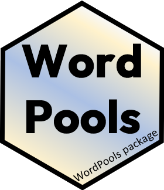

<!-- README.md is generated from README.Rmd. Please edit that file -->

```{r setup, include = FALSE}
knitr::opts_chunk$set(
  collapse = TRUE,
  warning = FALSE,
  comment = "#>",
  fig.path = "man/figures/README-",
  fig.height = 5,
  fig.width = 5
#  out.width = "100%"
)

options(digits = 4, width=100)
library(WordPools)
```

<!-- badges: start -->
[](https://zenodo.org/badge/latestdoi/14204994)
[](https://cran.r-project.org/package=WordPools) 
[](https://cran.r-project.org/package=WordPools)
[](https://friendly.github.io/WordPools)
<!-- badges: end -->

## WordPools 

**Word Pools Used in Studies of Learning and Memory**

Version: `1.2.0`

This package collects several classical word pools used
most often to provide lists of words in psychological
studies of learning and memory.  

Each word pool consists of a population of words, together
with various descriptive measures (number of letters,
number of syllables, word frequency, etc.) and 
normative measures (imagery, concreteness, etc.)
that can be used in experimental designs to vary
and control such factors.

One typical use is to design an experiment where stimulus words vary systematically
in one or more variables across conditions, but other variables are controlled
by random selection.

Other uses are to examine the factor structure of relations among these measures of
word properties.

### Word pools
The following word pools are available in the package:

* Toronto Word Pool (`TWP`) - from Friendly et al. (1982), contains 1080 words in various grammatical classes (nouns, adjectives, and verbs), taken originally from the Thorndike-Lorge (1944) norms)
* Paivio word pool (`Paivio`) - The Paivio, Yuille & Madigan (1968) word pool contains 925 nouns, together
  with average ratings of these words on imagery, concreteness and meaningfulness, along with other variables
* Battig - Montague Categorized Word Norms (`Battig`) - This dataset, from Battig & Montague (1968) 
  comprises a ranked list of 5231 words listed in 56 taxonomic categories by people who were asked to list as many exemplars of a given category.
* Category Properties (`CatProp`) - Properties of the 56 taxonomic categories from the Battig-Montague
category norms published by Joelson and Hermann (1978)

### Selecting lists
A simple function, `pickList()` is provided for the task of selecting several random samples
of words from a given word pool, with restrictions on the ranges of available variables.

~~A legacy web app (no longer maintained) for randomly selecting lists of words from the
Paivio word pool is provided at Friendly (2006)
[Paivio Word list generator](https://datavis.ca/online/paivio/).~~

A shiny app for randomly selecting lists of words from the
Paivio word pool is provided at Friendly & Dubins (2019a)
[Paivio Word list generator](https://euclid.psych.yorku.ca/shiny/Paivio).

A similar app for selecting lists from the Toronto Word Pool is
provided at Friendly & Dubins (2019b)
[Toronto Word Pool list generator](https://euclid.psych.yorku.ca/shiny/TWP).

### Installation

Install the current released version from CRAN:

    install.packages("WordPools")


### Examples

#### Using `pickList()

Select two lists of items of 5 items each from the Paivio pool:
```{r}
set.seed(42)     # for reproducibility
pickList(Paivio, nitems=5, nlists=2)
```

Using a list of ranges for imagery and concreteness:

```{r}
L <- list(imagery=c(1,5), 
          concreteness=c(1,4))
pickList(Paivio, ranges =L, nitems=4)
```


Define ranges for low and high on imagery, concreteness, meaningfulness
These go from low - median, and median-high on each variable
```{r}
vars <- 3:5
(low <- as.data.frame(apply(Paivio[,vars], 2, fivenum))[c(1,3),])
(high <- as.data.frame(apply(Paivio[,vars], 2, fivenum))[c(3,5),])
```

Select two lists of 10 low/high imagery items:
```{r}
lowI <- pickList(Paivio, low[,"imagery", drop=FALSE], nitems=10, nl=2)
highI <- pickList(Paivio, high[,"imagery", drop=FALSE], nitems=10, nl=2)
 
# compare means
colMeans(lowI[,c(4:8)])
colMeans(highI[,c(4:8)])
```

#### Using `dplyr`

The `dplyr` package makes it easy to select items meeting arbitrary criteria.  Here we `filter()` on
ranges for three variables in the `TWP` to get a reduced pool:
```{r}
library(dplyr)
selected <- TWP |>	
	filter( canadian == 0) |>              # remove Canadian spellings
	filter( imagery <= 5, concreteness <= 4, frequency <= 30) |>
	select(word, imagery:frequency )
str(selected)
```

Then, draw two random lists:
```{r}
  nitems <- 5
  nlists <- 2
  lists <- selected |>
  	sample_n( nitems*nlists, replace=FALSE) |>
  	mutate(list = rep(1:nlists, each=nitems))
  
  str(lists)
  lists |> knitr::kable()
```


#### Density plots

A simple function gives a density plot of any variable. It's interesting that these two are bimodal.

```{r TWP-density}
#| out.width = "49%",
#| fig.show = "hold"
plotDensity(TWP, "imagery")
plotDensity(TWP, "concreteness")
```


### References

Paivio, A., Yuille, J.C. & Madigan S. Concreteness, imagery and
meaningfulness for 925 nouns. (1968)  *Journal of Experimental Psychology*,
Monograph Supplement, **76**, No.1, pt.2.

Battig, W.F. & Montague, W.E. (1969).
    Category norms for verbal items in 56 categories: A replication and extension of the Connecticut norms. *Journal of Experimental Psychology*, 80 (1969), pp. 1-46

Friendly, M. (2006) [Paivio Word list generator](https://datavis.ca/online/paivio/)

Friendly, M. & Dubins, M. (2019a) [Paivio Word list generator](https://euclid.psych.yorku.ca/shiny/Paivio), Online application.

Friendly, M. & Dubins, M. (2019b) [Toronto Word Pool list generator](https://euclid.psych.yorku.ca/shiny/TWP), Online application.


Friendly, M., Franklin, P., Hoffman, D. & Rubin, D. The Toronto Word Pool,
*Behavior Research Methods and Instrumentation*, 1982, 14(4), 375-399.
[TWP paper PDF](https://datavis.ca/papers/twp.pdf)


