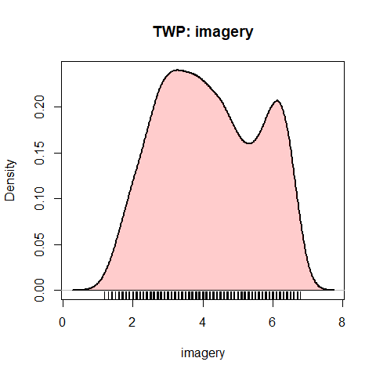
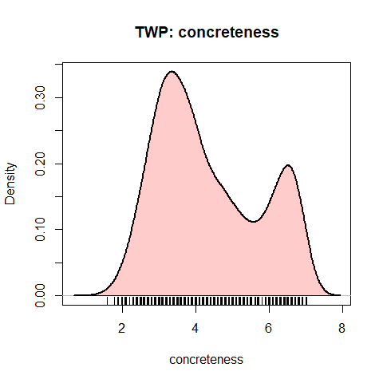

<!-- README.md is generated from README.Rmd. Please edit that file -->
<!-- badges: start -->

[](https://zenodo.org/badge/latestdoi/14204994)
[](https://cran.r-project.org/package=WordPools)
[](https://cran.r-project.org/package=WordPools)
[](https://friendly.github.io/WordPools)
<!-- badges: end -->

## WordPools 

**Word Pools Used in Studies of Learning and Memory**

Version: `1.2.0`

This package collects several classical word pools used most often to
provide lists of words in psychological studies of learning and memory.

Each word pool consists of a population of words, together with various
descriptive measures (number of letters, number of syllables, word
frequency, etc.) and normative measures (imagery, concreteness, etc.)
that can be used in experimental designs to vary and control such
factors.

One typical use is to design an experiment where stimulus words vary
systematically in one or more variables across conditions, but other
variables are controlled by random selection.

Other uses are to examine the factor structure of relations among these
measures of word properties.

### Word pools

The following word pools are available in the package:

- Toronto Word Pool (`TWP`) - from Friendly et al. (1982), contains 1080
  words in various grammatical classes (nouns, adjectives, and verbs),
  taken originally from the Thorndike-Lorge (1944) norms)
- Paivio word pool (`Paivio`) - The Paivio, Yuille & Madigan (1968) word
  pool contains 925 nouns, together with average ratings of these words
  on imagery, concreteness and meaningfulness, along with other
  variables
- Battig - Montague Categorized Word Norms (`Battig`) - This dataset,
  from Battig & Montague (1968) comprises a ranked list of 5231 words
  listed in 56 taxonomic categories by people who were asked to list as
  many exemplars of a given category.
- Category Properties (`CatProp`) - Properties of the 56 taxonomic
  categories from the Battig-Montague category norms published by
  Joelson and Hermann (1978)

### Selecting lists

A simple function, `pickList()` is provided for the task of selecting
several random samples of words from a given word pool, with
restrictions on the ranges of available variables.

~~A legacy web app (no longer maintained) for randomly selecting lists
of words from the Paivio word pool is provided at Friendly (2006)
[Paivio Word list generator](https://datavis.ca/online/paivio/).~~

A shiny app for randomly selecting lists of words from the Paivio word
pool is provided at Friendly & Dubins (2019a) [Paivio Word list
generator](https://euclid.psych.yorku.ca/shiny/Paivio).

A similar app for selecting lists from the Toronto Word Pool is provided
at Friendly & Dubins (2019b) [Toronto Word Pool list
generator](https://euclid.psych.yorku.ca/shiny/TWP).

### Installation

Install the current released version from CRAN:

    install.packages("WordPools")

### Examples

#### Using \`pickList()

Select two lists of items of 5 items each from the Paivio pool:

``` r
set.seed(42)     # for reproducibility
pickList(Paivio, nitems=5, nlists=2)
#>     list itmno          word imagery concreteness meaningfulness frequency syl letters freerecall
#> 578    1   578 misconception    2.30         1.79           3.96         1   4      13      0.531
#> 333    1   333          flag    6.60         6.94           6.54        50   1       4      0.219
#> 159    1   159     christmas    6.70         4.53           8.76        50   2       9      0.563
#> 78     1    78      basement    6.03         6.83           6.83         8   2       8      0.500
#> 238    1   238   destruction    5.27         3.61           5.32        37   3      11      0.469
#> 152    2   152         charm    4.70         2.17           6.13        50   1       5      0.219
#> 654    2   654     performer    5.43         6.01           6.48         4   3       9      0.344
#> 52     2    52         arrow    6.57         7.00           6.80        37   2       5      0.313
#> 133    2   133      capacity    3.40         2.41           5.44        37   4       8      0.094
#> 315    2   315      facility    2.73         2.20           4.64        23   3       8      0.281
```

Using a list of ranges for imagery and concreteness:

``` r
L <- list(imagery=c(1,5), 
          concreteness=c(1,4))
pickList(Paivio, ranges =L, nitems=4)
#>     list itmno       word imagery concreteness meaningfulness frequency syl letters freerecall
#> 57     1    57   atrocity    3.67         2.38           4.17         2   4       8      0.469
#> 281    1   281     effort    3.33         2.22           5.75       100   2       6      0.281
#> 457    1   457 inducement    2.93         2.34           3.68         3   3      10      0.406
#> 316    1   316       fact    2.20         3.31           4.29       100   1       4      0.438
```

Define ranges for low and high on imagery, concreteness, meaningfulness
These go from low - median, and median-high on each variable

``` r
vars <- 3:5
(low <- as.data.frame(apply(Paivio[,vars], 2, fivenum))[c(1,3),])
#>   imagery concreteness meaningfulness
#> 1    1.63         1.18           1.92
#> 3    5.17         5.72           5.92
(high <- as.data.frame(apply(Paivio[,vars], 2, fivenum))[c(3,5),])
#>   imagery concreteness meaningfulness
#> 3    5.17         5.72           5.92
#> 5    6.90         7.70           9.22
```

Select two lists of 10 low/high imagery items:

``` r
lowI <- pickList(Paivio, low[,"imagery", drop=FALSE], nitems=10, nl=2)
highI <- pickList(Paivio, high[,"imagery", drop=FALSE], nitems=10, nl=2)
 
# compare means
colMeans(lowI[,c(4:8)])
#>        imagery   concreteness meaningfulness      frequency            syl 
#>          3.783          3.416          5.232         39.000          2.400
colMeans(highI[,c(4:8)])
#>        imagery   concreteness meaningfulness      frequency            syl 
#>          6.161          6.301          6.702         35.300          1.900
```

#### Using `dplyr`

The `dplyr` package makes it easy to select items meeting arbitrary
criteria. Here we `filter()` on ranges for three variables in the `TWP`
to get a reduced pool:

``` r
library(dplyr)
#> 
#> Attaching package: 'dplyr'
#> The following objects are masked from 'package:stats':
#> 
#>     filter, lag
#> The following objects are masked from 'package:base':
#> 
#>     intersect, setdiff, setequal, union
selected <- TWP |>  
    filter( canadian == 0) |>              # remove Canadian spellings
    filter( imagery <= 5, concreteness <= 4, frequency <= 30) |>
    select(word, imagery:frequency )
str(selected)
#> 'data.frame':    269 obs. of  5 variables:
#>  $ word        : chr  "abide" "absorb" "abuse" "accord" ...
#>  $ imagery     : num  2 4.6 4.5 1.8 4.2 2.1 3.7 3.2 3.3 1.6 ...
#>  $ concreteness: num  2.8 3.6 3.4 2.6 3.5 3.6 3 3.9 3.5 2 ...
#>  $ letters     : int  5 6 5 6 6 8 6 5 6 4 ...
#>  $ frequency   : int  7 13 18 9 10 3 10 13 10 10 ...
```

Then, draw two random lists:

``` r
  nitems <- 5
  nlists <- 2
  lists <- selected |>
    sample_n( nitems*nlists, replace=FALSE) |>
    mutate(list = rep(1:nlists, each=nitems))
  
  str(lists)
#> 'data.frame':    10 obs. of  6 variables:
#>  $ word        : chr  "virtue" "gravely" "abuse" "upward" ...
#>  $ imagery     : num  3.1 2.1 4.5 4 4.6 5 4.4 4.2 3.1 3.5
#>  $ concreteness: num  2.1 2.8 3.4 4 3.9 3.3 3.1 3.5 3.2 2.8
#>  $ letters     : int  6 7 5 6 7 6 8 6 6 4
#>  $ frequency   : int  30 7 18 27 24 17 24 10 13 7
#>  $ list        : int  1 1 1 1 1 2 2 2 2 2
  lists |> knitr::kable()
```

| word     | imagery | concreteness | letters | frequency | list |
|:---------|--------:|-------------:|--------:|----------:|-----:|
| virtue   |     3.1 |          2.1 |       6 |        30 |    1 |
| gravely  |     2.1 |          2.8 |       7 |         7 |    1 |
| abuse    |     4.5 |          3.4 |       5 |        18 |    1 |
| upward   |     4.0 |          4.0 |       6 |        27 |    1 |
| nervous  |     4.6 |          3.9 |       7 |        24 |    1 |
| horror   |     5.0 |          3.3 |       6 |        17 |    2 |
| charming |     4.4 |          3.1 |       8 |        24 |    2 |
| accuse   |     4.2 |          3.5 |       6 |        10 |    2 |
| behave   |     3.1 |          3.2 |       6 |        13 |    2 |
| envy     |     3.5 |          2.8 |       4 |         7 |    2 |

#### Density plots

A simple function gives a density plot of any variable. It’s interesting
that these two are bimodal.

``` r
plotDensity(TWP, "imagery")
plotDensity(TWP, "concreteness")
```



### References

Paivio, A., Yuille, J.C. & Madigan S. Concreteness, imagery and
meaningfulness for 925 nouns. (1968) *Journal of Experimental
Psychology*, Monograph Supplement, **76**, No.1, pt.2.

Battig, W.F. & Montague, W.E. (1969). Category norms for verbal items in
56 categories: A replication and extension of the Connecticut norms.
*Journal of Experimental Psychology*, 80 (1969), pp. 1-46

Friendly, M. (2006) [Paivio Word list
generator](https://datavis.ca/online/paivio/)

Friendly, M. & Dubins, M. (2019a) [Paivio Word list
generator](https://euclid.psych.yorku.ca/shiny/Paivio), Online
application.

Friendly, M. & Dubins, M. (2019b) [Toronto Word Pool list
generator](https://euclid.psych.yorku.ca/shiny/TWP), Online application.

Friendly, M., Franklin, P., Hoffman, D. & Rubin, D. The Toronto Word
Pool, *Behavior Research Methods and Instrumentation*, 1982, 14(4),
375-399. [TWP paper PDF](https://datavis.ca/papers/twp.pdf)
